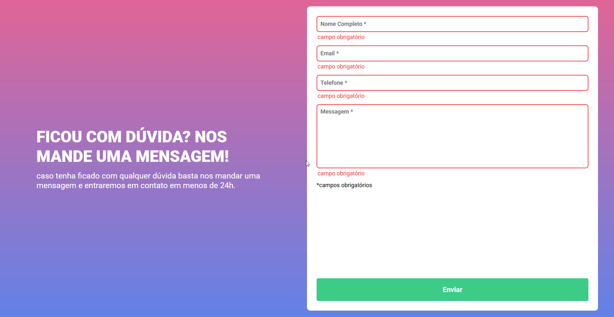

# 📄 Formulário com Validação — DevQuest

Projeto prático desenvolvido durante o **curso DevQuest (Módulo: JavaScript Intermediário)**, com o foco de formação de desenvolvedores **Full Stack**. O objetivo foi aplicar validação de formulário utilizando **JavaScript puro**, conforme requisitos propostos na atividade.

---

## 📌 Descrição

Este desafio consistia em criar um formulário com validação manual, sem utilizar bibliotecas externas.  
Ao tentar enviar o formulário com campos vazios, cada campo incorreto exibe uma **mensagem de erro personalizada** e tem a **borda destacada em vermelho**, conforme o layout de referência no Figma.

O fundo da aplicação também foi customizado com a **imagem fornecida na aula**, bem como o layout da página, garantindo um visual alinhado à proposta da atividade.

---

## ⚙️ Funcionalidades

- Validação manual de campos obrigatórios com JavaScript puro
- Exibição dinâmica de mensagens de erro
- Estilização automática de campos inválidos (borda vermelha)
- Layout com fundo personalizado via imagem

---

## 🛠️ Tecnologias

- **HTML5**  
- **CSS3**  
- **JavaScript (vanilla)**

---

## 🖥️ Resultado

  

---

## 🔗 Visualização

👉 [**Clique aqui para visualizar o projeto no GitHub Pages**](https://inocenciooo.github.io/validacao-formulario/)

---

## 💬 Aprendizado

Neste projeto, exercitei:

- Uso de `addEventListener` para interceptar o envio do formulário
- Iteração com `forEach` para aplicar validações a múltiplos campos
- Manipulação de classes (`classList.add` e `classList.remove`) para exibir feedback visual de erro ou sucesso
- Validação de campos obrigatórios de forma simples e eficaz
- Aplicação de lógica de remoção da mensagem de erro ao perder o foco do campo (`blur`)

